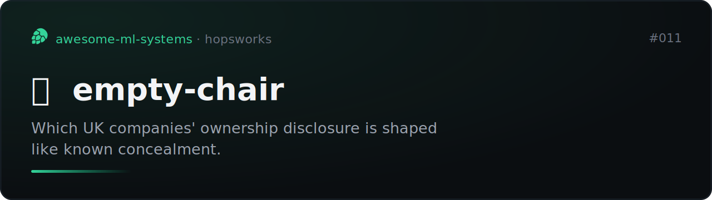
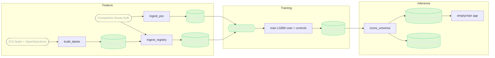

# empty-chair



[](https://github.com/MagicLex/awesome-ml-systems)
[](https://www.hopsworks.ai/)

The inverse model. Most detectors hunt the suspicious thing that is present: the
nominee with 400 directorships, the offshore address. This one hunts the thing
that is deliberately absent. It scores a UK company for how much its public
ownership **disclosure** is shaped like the structures where a hidden beneficial
owner was later revealed, in the ICIJ offshore leaks or on the OpenSanctions
consolidated list (sanctions regimes plus debarment, crime and PEP-linked
watchlists). The
empty chair where an owner should be.

It reports a **signal, not a verdict**. A high rank means the disclosure resembles
a known concealment shape, never that the company hid anyone or that any person did
anything wrong. Most companies with this shape are legitimate: holding companies,
family property firms, dormant shells with nothing to hide.

## The result

`empty_chair` v4, a 10-seed LightGBM soft-vote over the 28 registry and PSC
(people-with-significant-control) features plus tell interactions and grouped
out-of-fold target encodings. Held out by formation-address cluster so no company
mill straddles train and test. The recipe came out of an autoresearch round
(22 logged experiments, [`autoresearch/REPORT.md`](autoresearch/REPORT.md)) that
lifted PR-AUC 31.7% over the v3 HistGradientBoosting baseline.

| metric (grouped holdout, 21,350 companies) | value |
|---|---:|
| PR-AUC | **0.377** |
| PR-AUC lift over base rate | **8.0×** |
| ROC-AUC | 0.882 |
| precision@100 | 0.95 |
| precision@1000 | 0.373 |
| blind investigator rule (PR-AUC) | 0.049 |
| demographics-only control (PR-AUC) | 0.070 |
| shuffle-label control (PR-AUC) | 0.050 |

The controls are the point. The naive investigator rule (flag anything silent,
corporate-only, or foreign-corporate) scores at the base rate: useless alone. A
demographics-only model (incorporation year, sector, region) barely beats chance,
so the signal is **not** population bias, it is the shape of the disclosure. The
shuffle-label run collapses to chance, so there is no leak, target encodings
included. Of the 100 companies the model flags hardest, 95 are genuine
later-revealed cases at a 4.8% base rate. The autoresearch round also pruned the
mill-address and dormant-accounts confounds as an ablation: it cost 0.002 PR-AUC,
so the model rides the PSC concealment shape, not the population confound.

## Caveats

Read these before quoting the number.

- **PU-learned, the number is a lower bound.** Positives are companies whose hidden
  interest was *later revealed*. Hidden owners never revealed sit unlabelled in the
  clean class, so every metric understates true performance.
- **The label is a name match.** ICIJ and sanctions names are matched to Companies
  House by normalized exact match. Single-token generic names are down-weighted, but
  the match set carries false positives that no one has hand-verified; treat the
  positive labels as noisy.
- **Rank, not probability.** Calibration holds on the 20:1 case-control sample, not
  on the 5.7M population. The app presents a population **percentile**, not a
  probability of concealment.
- **Disclosure shape, not intent.** The model never sees who owns the company. A
  high rank is a structural resemblance, never proof of concealment.

## Architecture

An FTI (feature, training, inference) system on Hopsworks. Feature extraction is one
shared, pure function (`chair_features.py`) so training and serving cannot skew.



The inverse framing is the core design. The features describe the *shape of the
disclosure*, not the owner: whether a natural person is declared at all, whether
ownership routes only through corporate entities, whether the company sits silent
behind a no-PSC statement, an exemption, or a super-secure protected record, whether
it is registered at a formation-mill address. The label is what the disclosure was
hiding, revealed after the fact.

The file-by-file map:

```
chair_features.py     shared, pure: CH row + PSC records -> 28 features + fired tells
build_labels.py       F1  ICIJ + sanctions -> revealed_owner (label)      (job)
ingest_registry.py    F2  CH bulk -> company_registry (case-control 20:1)  (job)
ingest_psc.py         F3  PSC snapshot -> psc_shape                        (job)
train_chair.py        T   feature view -> empty_chair + honesty controls   (job)
auditor.py            I   load model, score a company, list fired tells
score_universe.py     I1  score all 5.7M -> parquet + concealment_dossiers (job)
build_linkage.py      I2  top 1% -> shared-owner nests (linkage.parquet)   (job)
explain.py            I   plain-language dossier (Anthropic), signal not verdict
ask.py                I   ask-the-register: tool-use loop over the live data
bias_audit.py         pre-publication confound audit -> docs/bias-audit.md
app/server.py         the review app: audit, chair diagram, webs, ask
app/deploy_app.py     deploy the app
```

## Data

All public and free. Companies House basic company data + PSC snapshot (bulk,
Companies House), ICIJ Offshore Leaks database (bulk CSV), and the OpenSanctions
consolidated targets export (`targets.simple.csv`, [default
dataset](https://www.opensanctions.org/datasets/default/): sanctions plus
debarment, crime and PEP-linked watchlists; GB entities only). The two
heavy captures are kept out of git; `build_labels` and `ingest_registry` rebuild
every feature group from them.

## Reproduce

Clone into a Hopsworks project on the `/hopsfs/...` FUSE mount. Paths self-derive.
The Anthropic key lives in a project secret (`ANTHROPIC_API_KEY`).

```bash
# capture the bulk data into data/ (Companies House, ICIJ, OpenSanctions)
python build_labels.py                       # F1  revealed_owner
python deploy_registry.py && hops job run ingest-registry   # F2  company_registry
python deploy_psc.py && hops job run ingest-psc             # F3  psc_shape
python deploy_train.py && hops job run train-chair          # T   empty_chair
python deploy_score.py && hops job run score-universe       # I1  scores + dossiers
python app/deploy_app.py                     # the review app
```

## The demo

`emptychair`, a two-pane review. Paste any UK company number or name: the company's
disclosure evidence renders on the left (every tell with its population base rate,
fired ones dark), and a rank rail on the right shows the percentile stamp, the score
distribution with the company pinned on it, and streams a plain-language
investigator's note. When the company sits in a scored nest, its ownership web
renders below: owners as squares, companies as dots colored by score, shared
companies as red bridges.

`/network` shows the concealment webs: nests that share a company are unioned into
connected graphs (the largest joins 100+ owners). All graphs are server-rendered SVG
that works without JavaScript; with it, they hydrate into pan/zoom, ego-highlight on
hover, tooltips, and draggable nodes over a spring simulation seeded from the server
layout. The rank comes from the ML model; the note only explains it, signal not
verdict.

Every page carries **Ask the register**, a full-height chat drawer pinned to the
right edge. The model (`ask.py`) answers only through deterministic tools over the
live data: company lookup, ownership webs, name and owner search, population
stats. No embeddings, no invented numbers; if a tool returns nothing, the answer
says so. Tokens stream over a websocket (the platform proxy buffers plain HTTP
streaming) with each tool call shown as a status row. The chat is contextual: it
knows which page is open, and clicking any owner square in a graph points the
conversation at that owner. Replies interpret the figures concretely, percentile
arithmetic and tell base rates included, under the same never-accuse constraints.
Without JavaScript it degrades to a full-page round trip.
